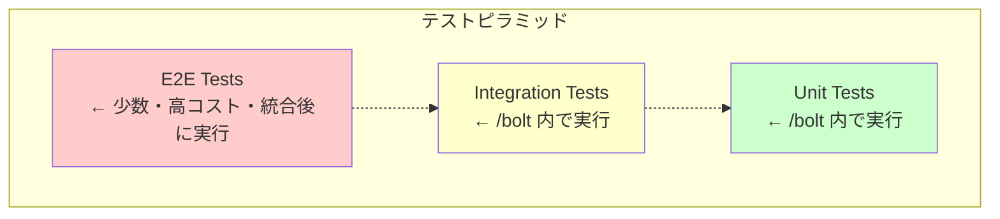
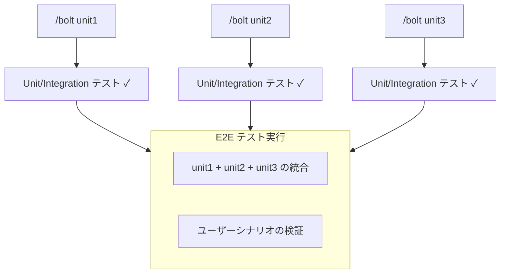
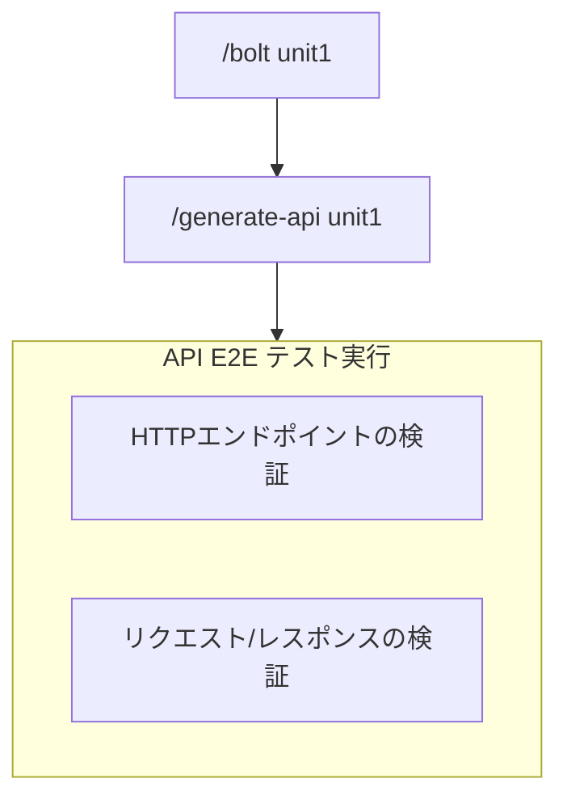
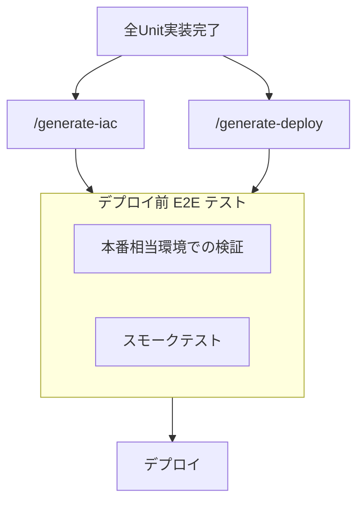
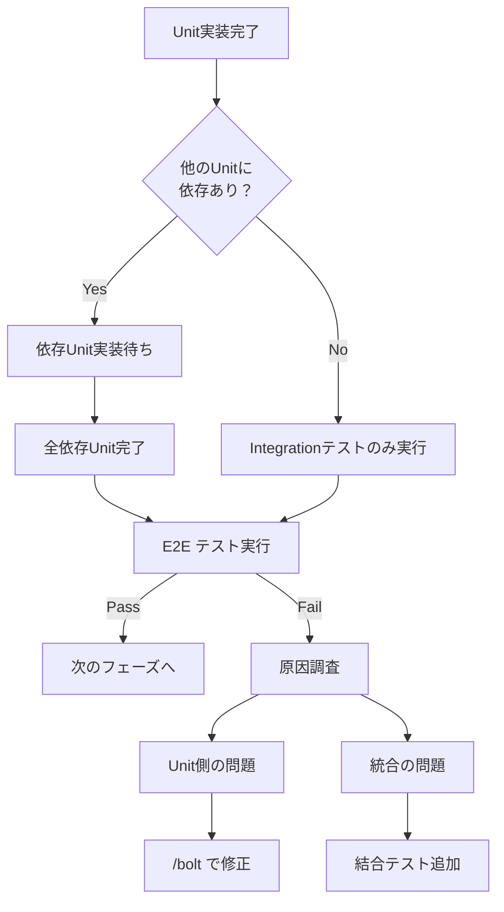
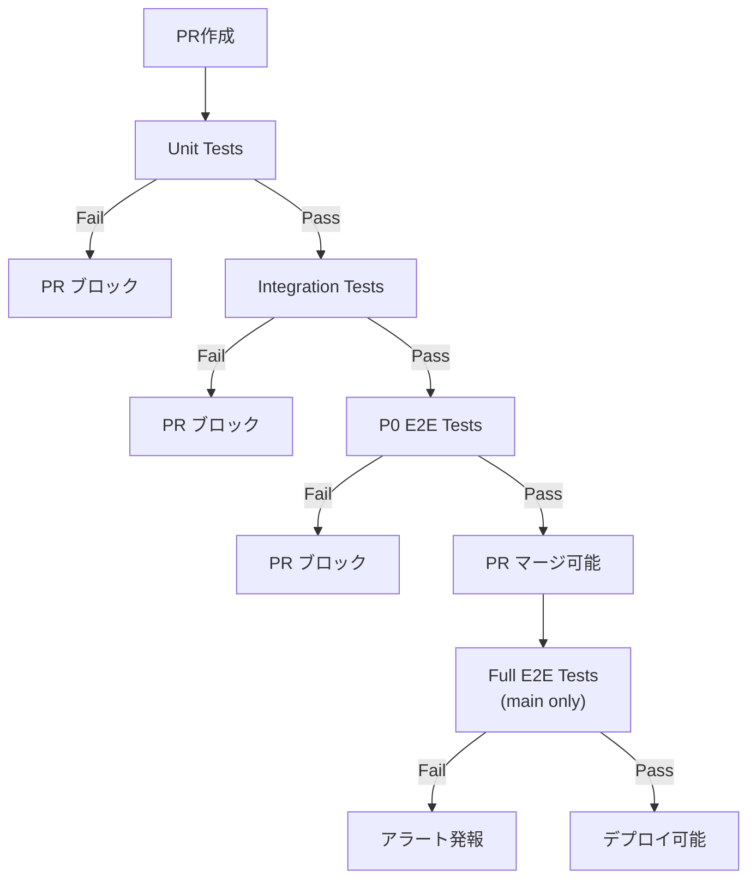

# E2Eテスト実行フローガイド

このガイドでは、AI-DLC開発サイクルにおけるE2E（End-to-End）テストの実行タイミング、戦略、および実装方法を説明します。

## テストピラミッド概要



| テスト種類 | 実行タイミング | 実行頻度 | 対象 |
|-----------|---------------|---------|------|
| Unit | `/bolt` 内 | 毎回 | 単一関数/クラス |
| Integration | `/bolt` 内 | 毎回 | コンポーネント間 |
| E2E | Unit完了後 | 統合時 | システム全体 |

---

## E2Eテスト実行タイミング

### タイミング1: 複数Unit統合後



**実行コマンド例:**
```bash
# 全Unitの実装完了後
pnpm test:e2e

# または特定のシナリオのみ
pnpm test:e2e --grep "ユーザー認証フロー"
```

### タイミング2: API生成後



### タイミング3: デプロイ前



---

## E2Eテスト戦略

### 優先度による分類

| 優先度 | 説明 | 実行タイミング | 例 |
|-------|------|---------------|-----|
| P0 | クリティカルパス | 毎回 | ログイン、決済 |
| P1 | 重要機能 | デプロイ前 | 検索、プロフィール更新 |
| P2 | 補助機能 | 週次/手動 | 設定変更、ヘルプ表示 |

### P0テスト（必須）

毎回の統合時に実行すべきテスト：

```gherkin
# P0: ユーザー認証フロー
Feature: ユーザー認証

  @p0 @critical
  Scenario: 正常なログインフロー
    Given 有効なユーザーアカウントが存在する
    When ログインページにアクセスする
    And 正しい認証情報を入力する
    And ログインボタンをクリックする
    Then ダッシュボードが表示される
    And セッションが確立される

  @p0 @critical
  Scenario: 無効な認証情報でのログイン
    Given ログインページが表示されている
    When 誤った認証情報を入力する
    Then エラーメッセージが表示される
    And ログインページにとどまる
```

### P1テスト（重要）

デプロイ前に実行すべきテスト：

```gherkin
# P1: 検索機能
Feature: 商品検索

  @p1
  Scenario: キーワード検索
    Given 商品が登録されている
    When 検索キーワードを入力する
    Then 関連する商品が表示される
```

### P2テスト（補助）

週次または手動で実行するテスト：

```gherkin
# P2: 設定変更
Feature: ユーザー設定

  @p2
  Scenario: 通知設定の変更
    Given ユーザーがログインしている
    When 設定画面で通知をオフにする
    Then 設定が保存される
```

---

## 実行フローチャート

### E2Eテスト実行判断



---

## E2Eテスト実装ガイド

### ディレクトリ構造

```
tests/
├── unit/              # /bolt で生成・実行
├── integration/       # /bolt で生成・実行
└── e2e/               # 統合後に実行
    ├── scenarios/
    │   ├── auth/
    │   │   ├── login.spec.ts
    │   │   └── logout.spec.ts
    │   ├── user/
    │   │   └── profile.spec.ts
    │   └── payment/
    │       └── checkout.spec.ts
    ├── fixtures/
    │   └── test-data.ts
    └── support/
        └── commands.ts
```

### テストファイル命名規則

```
{機能名}.spec.ts
{機能名}.{シナリオ}.spec.ts
```

例：
- `login.spec.ts`
- `checkout.success.spec.ts`
- `checkout.failure.spec.ts`

### 推奨ツール

| ツール | 用途 | 特徴 |
|-------|------|------|
| Playwright | ブラウザE2E | クロスブラウザ対応 |
| Cypress | ブラウザE2E | 開発者体験が良い |
| Supertest | API E2E | Node.js向け |
| k6 | 負荷テスト | パフォーマンス検証 |

### 設定例（Playwright）

```typescript
// playwright.config.ts
import { defineConfig } from '@playwright/test';

export default defineConfig({
  testDir: './tests/e2e',
  timeout: 30000,
  retries: 2,
  use: {
    baseURL: process.env.BASE_URL || 'http://localhost:3000',
    trace: 'on-first-retry',
  },
  projects: [
    { name: 'chromium', use: { browserName: 'chromium' } },
    { name: 'firefox', use: { browserName: 'firefox' } },
  ],
});
```

### テストコード例

```typescript
// tests/e2e/scenarios/auth/login.spec.ts
import { test, expect } from '@playwright/test';

test.describe('ユーザー認証', () => {
  test('@p0 正常なログインフロー', async ({ page }) => {
    // Given: ログインページにアクセス
    await page.goto('/login');

    // When: 認証情報を入力
    await page.fill('[data-testid="email"]', 'user@example.com');
    await page.fill('[data-testid="password"]', 'password123');
    await page.click('[data-testid="login-button"]');

    // Then: ダッシュボードに遷移
    await expect(page).toHaveURL('/dashboard');
    await expect(page.locator('h1')).toContainText('ダッシュボード');
  });

  test('@p0 無効な認証情報', async ({ page }) => {
    await page.goto('/login');

    await page.fill('[data-testid="email"]', 'user@example.com');
    await page.fill('[data-testid="password"]', 'wrong-password');
    await page.click('[data-testid="login-button"]');

    // Then: エラーメッセージ表示
    await expect(page.locator('[data-testid="error-message"]'))
      .toContainText('認証情報が無効です');
    await expect(page).toHaveURL('/login');
  });
});
```

---

## CI/CDでのE2Eテスト

### GitHub Actions 設定例

```yaml
# .github/workflows/e2e.yml
name: E2E Tests

on:
  push:
    branches: [main, develop]
  pull_request:
    branches: [main]

jobs:
  e2e-p0:
    name: P0 Critical Tests
    runs-on: ubuntu-latest
    steps:
      - uses: actions/checkout@v4
      - uses: pnpm/action-setup@v2
      - uses: actions/setup-node@v4
        with:
          node-version: '20'
          cache: 'pnpm'

      - run: pnpm install
      - run: pnpm build

      - name: Run P0 E2E Tests
        run: pnpm test:e2e --grep "@p0"
        env:
          BASE_URL: http://localhost:3000

      - uses: actions/upload-artifact@v4
        if: failure()
        with:
          name: e2e-report
          path: playwright-report/

  e2e-full:
    name: Full E2E Tests
    runs-on: ubuntu-latest
    needs: e2e-p0
    if: github.ref == 'refs/heads/main'
    steps:
      - uses: actions/checkout@v4
      - uses: pnpm/action-setup@v2
      - uses: actions/setup-node@v4
        with:
          node-version: '20'
          cache: 'pnpm'

      - run: pnpm install
      - run: pnpm build

      - name: Run All E2E Tests
        run: pnpm test:e2e
```

### 実行フロー



---

## トラブルシューティング

### E2Eテストが不安定（Flaky）

**原因と対策:**

| 原因 | 対策 |
|-----|------|
| タイミング問題 | 明示的な待機を追加 |
| テストデータ競合 | テスト毎にデータ初期化 |
| 環境依存 | Docker等で環境を固定 |
| ネットワーク遅延 | タイムアウトを適切に設定 |

**コード例（明示的な待機）:**
```typescript
// Bad: 暗黙的な待機
await page.click('button');
expect(await page.textContent('h1')).toBe('完了');

// Good: 明示的な待機
await page.click('button');
await page.waitForSelector('h1:has-text("完了")');
expect(await page.textContent('h1')).toBe('完了');
```

### E2Eテストが遅い

**対策:**

1. **並列実行を有効化**
   ```typescript
   // playwright.config.ts
   export default defineConfig({
     workers: 4,  // 並列ワーカー数
   });
   ```

2. **P0テストのみを頻繁に実行**
   ```bash
   pnpm test:e2e --grep "@p0"
   ```

3. **APIモックの活用**
   ```typescript
   await page.route('**/api/slow-endpoint', route => {
     route.fulfill({ body: JSON.stringify({ data: 'mocked' }) });
   });
   ```

---

## 参考資料

- [ワークフローDAG](./workflow-dag.md) - コマンド間の依存関係
- [実装スコープ](./implementation-scope.md) - 各コマンドの完了条件
- [テスト設計SubAgent](./.claude/agents/test-designer/README.md) - テスト設計詳細
