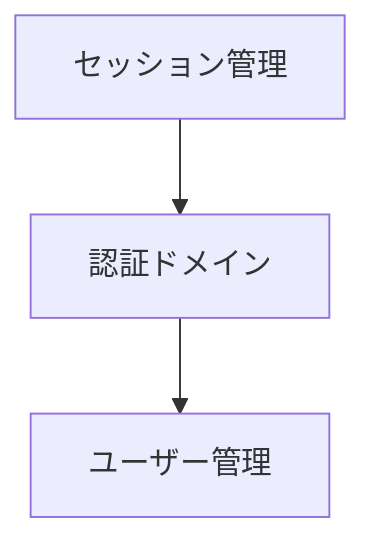

# AI-DLC 開発開始ガイド

このガイドでは、AI-DLC（AI-Driven Development Lifecycle）テンプレートを使った開発の開始方法を説明します。

## 前提条件

- Node.js v18以上
- pnpm 8以上
- Claude Code CLI
- git

## 1. プロジェクトの作成

### このテンプレートから新規プロジェクトを作成

```bash
# GitHubからクローン
git clone https://github.com/y-miyachika/ai-dlc-template.git my-new-project
cd my-new-project
rm -rf .git && git init  # 新規リポジトリとして初期化
```

または、GitHub上で「Use this template」ボタンから新規リポジトリを作成できます。

### AI-DLC環境のセットアップ

```bash
# Claude Codeで /setup-aidlc を実行
/setup-aidlc my-new-project
```

このコマンドは以下を実行します：

1. **プロジェクト情報の収集**（対話形式）
   - プロジェクト名
   - プロジェクトタイプ（app/package/monorepo）
   - 技術スタック

2. **pnpm workspace設定の作成**
   - package.json
   - pnpm-workspace.yaml

3. **ディレクトリ構造の作成**
   - apps/ または packages/
   - docs/以下のAI-DLC成果物用ディレクトリ

4. **設定ファイルの生成**
   - CLAUDE.md（プロジェクト固有）
   - README.md（プロジェクト固有）
   - .gitignore

### 依存関係のインストール

```bash
pnpm install
```

## 2. 最初のインテント定義

AI-DLCでは、開発の最初のステップとして「インテント定義」を行います。これは、要件を明確化し、チーム全体で共通認識を持つための重要なプロセスです。

### インテント定義の実行

```bash
/intent ユーザー認証機能の実装
```

Claudeが以下の4つの質問で要件を明確化します：

1. **ビジネス価値の明確化**
   - なぜこの機能が必要か？
   - どのようなビジネス価値を提供するか？

2. **ユーザーストーリーの詳細化**
   - 誰が（ユーザー）
   - 何を（アクション）
   - なぜ（目的）

3. **受入基準の定義**
   - 機能要件
   - 非機能要件（NFR）
   - 制約事項

4. **リスクと依存関係**
   - 技術的リスク
   - 外部システムへの依存

### 出力例

`docs/intents/001_ユーザー認証機能.md` が生成されます：

```markdown
# Intent 001: ユーザー認証機能の実装

## ユーザーストーリー

**As a** システム管理者
**I want** ユーザーがメールアドレスとパスワードでログインできる機能
**So that** 権限に応じた機能へのアクセス制御ができる

## 受入基準（BDD形式）

### シナリオ1: 正常なログイン
**Given** 有効なユーザーアカウントが存在する
**When** 正しいメールアドレスとパスワードを入力してログインする
**Then** ダッシュボード画面に遷移する
**And** セッションが確立される

### シナリオ2: 無効な認証情報
**Given** ログイン画面が表示されている
**When** 誤ったメールアドレスまたはパスワードを入力する
**Then** エラーメッセージが表示される
**And** ログイン画面にとどまる

## 非機能要件（NFR）

- **パフォーマンス**: 認証処理は1秒以内に完了すること
- **セキュリティ**: パスワードはbcryptでハッシュ化すること
- **可用性**: 99.9%の稼働率を維持すること

## リスクと依存関係

- **技術的リスク**: セッション管理の複雑性
- **外部依存**: メール送信サービス（パスワードリセット用）
```

## 3. ユニット分解

インテントが定義できたら、次は実装可能な単位（ユニット）に分解します。

```bash
/units 001
```

Claudeがインテントを分析し、疎結合・高凝集なユニットに分解します：

- **unit1**: 認証ドメイン（コアロジック）
- **unit2**: ユーザー管理ドメイン
- **unit3**: セッション管理

出力例: `docs/units/001_ユニット分解.md`

```markdown
# ユニット分解: Intent 001 - ユーザー認証機能

## ユニット一覧

### unit1: 認証ドメイン
**責務**: ユーザー認証のコアロジック
**境界**: 認証情報の検証、トークン発行
**依存**: unit2（ユーザー情報の取得）

### unit2: ユーザー管理ドメイン
**責務**: ユーザー情報のCRUD
**境界**: ユーザーデータの永続化
**依存**: なし

### unit3: セッション管理
**責務**: セッションの作成・検証・破棄
**境界**: セッションストア
**依存**: unit1（認証トークン）

## 依存関係図


```

## 4. 設計フェーズ

各ユニットに対して、以下の3つの設計を行います。

### 4.1 ドメイン設計

```bash
/design-domain unit1
```

DDD（ドメイン駆動設計）の原則に基づき、エンティティ、値オブジェクト、集約などを設計します。

出力: `docs/design-artifacts/domain/001-unit1_認証ドメイン.md`

### 4.2 アーキテクチャ設計

```bash
/design-architecture unit1
```

NFRを考慮したアーキテクチャパターンを選択し、トレードオフを分析します。

出力: `docs/design-artifacts/architecture/001-unit1_認証ドメイン.md`

ADR（Architecture Decision Record）も自動生成されます：
`docs/design-artifacts/adr/001-unit1_認証パターン選択.md`

### 4.3 テスト設計

```bash
/design-test unit1
```

BDD受入基準からTDDテストケースを生成し、テスト実装計画を立てます。

出力: `docs/design-artifacts/tests/001-unit1_認証ドメイン_テスト設計.md`

## 5. 実装フェーズ（Boltサイクル）

設計が完了したら、Boltサイクルで高速に実装します。

```bash
/bolt unit1
```

Boltサイクルは以下のステップを1サイクルで実行します：

1. **計画作成**: 実装手順を詳細化（既存の場合はスキップ）
2. **ユーザー承認**: 計画内容を確認し、承認
3. **TDDサイクル**: Red → Green → Refactorで実装
4. **テスト実行**: 全テストが通ることを確認
5. **次ステップ提案**: 次のユニットや改善提案

## 6. コミットとレビュー

実装が完了したら、コミットしてプッシュします：

```bash
# 変更内容の確認
git status
git diff

# コミット（HEREDOC形式）
git commit -m "$(cat <<'EOF'
機能追加: ユーザー認証機能（unit1: 認証ドメイン）

## 実装内容
- 認証サービスの実装
- パスワードハッシュ化（bcrypt）
- トークン発行機能

## テスト
- 正常系テスト: 5件
- 異常系テスト: 3件

🤖 Generated with [Claude Code](https://claude.com/claude-code)

Co-Authored-By: Claude <noreply@anthropic.com>
EOF
)"

# プッシュ
git push
```

## 7. 次のユニットへ

unit1の実装が完了したら、unit2, unit3と順次実装していきます：

```bash
/design-domain unit2
/design-architecture unit2
/design-test unit2
/bolt unit2
```

## トラブルシューティング

### ディレクトリが見つからない

```bash
# セットアップを再実行
/setup-aidlc
```

### インテントファイルが見つからない

```bash
# docs/intents/ ディレクトリを確認
ls -la docs/intents/

# 手動で作成する場合
mkdir -p docs/intents
```

### Boltサイクルが失敗する

1. テスト設計が完了しているか確認
2. 依存ユニットが実装済みか確認
3. ドメイン設計とアーキテクチャ設計の整合性を確認

## 参考資料

- [AI-DLC日本語訳](../AI-DLC_日本語訳.md)
- [AI-DLC準拠状況](../AI-DLC準拠状況.md)
- [ワークフローガイド](./workflow.md)
