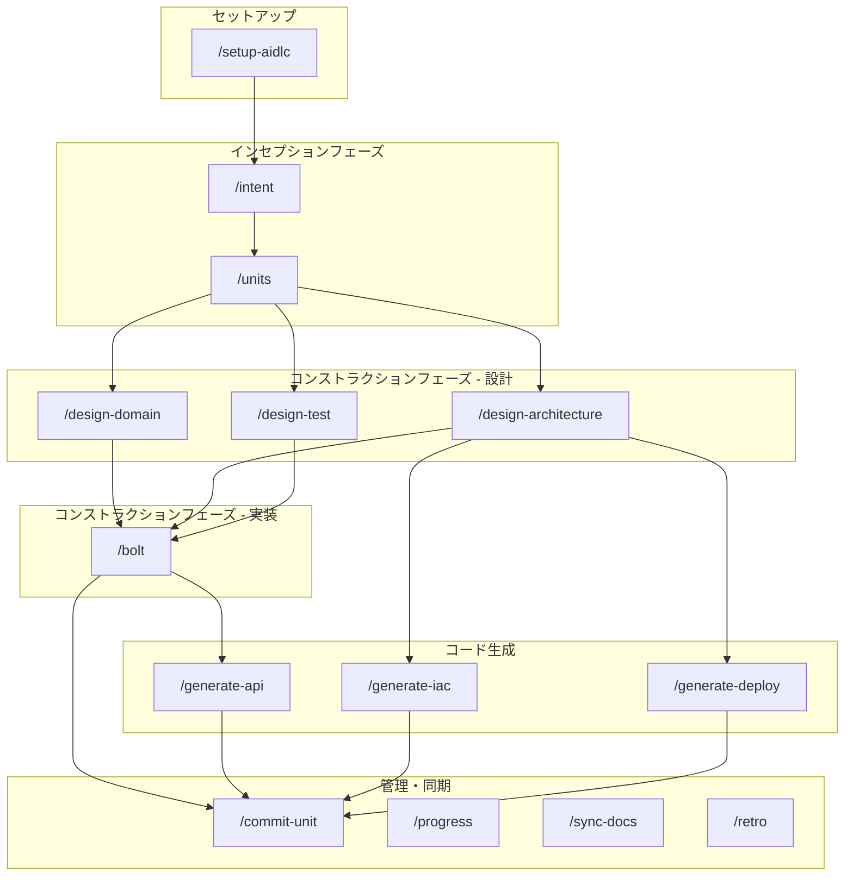

# AI-DLC コマンド依存関係図（DAG）

このガイドでは、AI-DLCスラッシュコマンド間の依存関係を図示し、正しい実行順序と並列実行可能な組み合わせを説明します。

## 全体依存関係図



## コマンド別依存関係

### 1. セットアップ

| コマンド | 前提条件 | 出力 |
|---------|---------|------|
| `/setup-aidlc` | なし（初回のみ） | package.json, pnpm-workspace.yaml, docs/ |

### 2. インセプションフェーズ

| コマンド | 前提条件 | 出力 |
|---------|---------|------|
| `/intent` | `/setup-aidlc` 完了 | docs/intents/{番号}_{タイトル}.md |
| `/units` | `/intent` で Intent 作成済み | docs/units/{Intent番号}_ユニット分解.md |

### 3. コンストラクションフェーズ - 設計

| コマンド | 前提条件 | 出力 | 並列実行 |
|---------|---------|------|---------|
| `/design-domain` | `/units` 完了 | docs/design-artifacts/domain/ | 可能* |
| `/design-architecture` | `/units` 完了 | docs/design-artifacts/architecture/, adr/ | 可能* |
| `/design-test` | `/units` 完了 | docs/design-artifacts/tests/ | 可能* |

**\*注意**: 3つの設計コマンドは**同一ユニットに対しては順次実行を推奨**。異なるユニット間では並列実行可能。

```
推奨順序（同一ユニット）:
/design-domain unit1 → /design-architecture unit1 → /design-test unit1

並列可能（異なるユニット）:
/design-domain unit1  |  /design-domain unit2
         ↓            |           ↓
/design-architecture  |  /design-architecture
```

### 4. コンストラクションフェーズ - 実装

| コマンド | 前提条件 | 出力 |
|---------|---------|------|
| `/bolt` | 3つの設計コマンド完了 | src/, tests/, docs/plans/ |

### 5. コード生成

| コマンド | 前提条件 | 出力 | 並列実行 |
|---------|---------|------|---------|
| `/generate-api` | `/bolt` で services 層実装済み | packages/api/, docs/api/ | 可能 |
| `/generate-iac` | `/design-architecture` 完了 | terraform/ | 可能 |
| `/generate-deploy` | `/design-architecture` 完了 | .github/workflows/, scripts/ | 可能 |

```
並列実行可能:
/generate-api unit1  |  /generate-iac unit1  |  /generate-deploy unit1
```

## 詳細フロー図

### 新規プロジェクト開発フロー

```
/setup-aidlc
     │
     ▼
/intent "機能概要"
     │
     ▼
/units 001
     │
     ├─────────────────┬─────────────────┐
     ▼                 ▼                 ▼
/design-domain    /design-arch      /design-test
    unit1            unit1              unit1
     │                 │                 │
     └─────────────────┼─────────────────┘
                       ▼
                  /bolt unit1
                       │
     ┌─────────────────┼─────────────────┐
     ▼                 ▼                 ▼
/generate-api     /generate-iac    /generate-deploy
    unit1            unit1              unit1
     │                 │                 │
     └─────────────────┼─────────────────┘
                       ▼
                /commit-unit 1
                       │
                       ▼
              次のユニット（unit2）へ
```

### マルチユニット並列開発フロー

複数ユニットが**独立**している場合、並列開発が可能です：

```
/units 001
     │
     ├───────────────────────────────────┐
     │                                   │
     ▼                                   ▼
[unit1: 認証ドメイン]              [unit2: ユーザー管理]
     │                                   │
     ▼                                   ▼
/design-domain unit1              /design-domain unit2
     │                                   │
     ▼                                   ▼
/design-architecture unit1        /design-architecture unit2
     │                                   │
     ▼                                   ▼
/design-test unit1                /design-test unit2
     │                                   │
     ▼                                   ▼
/bolt unit1                       /bolt unit2
     │                                   │
     └───────────────┬───────────────────┘
                     ▼
              統合テスト実行
                     │
                     ▼
            /commit-unit (両ユニット)
```

**注意**: 依存関係があるユニット（例: unit3 → unit1）は順次実行が必要。

## SubAgent/Skill の使い分け

```
┌─────────────────────────────────────────────────────────────┐
│                    SubAgents（深い思考・対話型）              │
│                                                             │
│  ┌─────────────┐  ┌─────────────┐  ┌─────────────┐         │
│  │intent-definer│→│units-decomposer│→│domain-designer│       │
│  └─────────────┘  └─────────────┘  └─────────────┘         │
│         │                                    │              │
│         │         ┌─────────────────┐       │              │
│         │         │architecture-    │       │              │
│         │         │designer         │←──────┘              │
│         │         └─────────────────┘                      │
│         │                  │                               │
│         │         ┌─────────────┐                         │
│         └────────→│test-designer │                         │
│                   └─────────────┘                         │
└─────────────────────────────────────────────────────────────┘
                              │
                              ▼
┌─────────────────────────────────────────────────────────────┐
│                    Skills（コード生成型）                    │
│                                                             │
│  ┌─────────────┐  ┌─────────────┐  ┌─────────────┐         │
│  │api-generator │  │iac-generator │  │deploy-      │         │
│  │              │  │              │  │generator    │         │
│  └─────────────┘  └─────────────┘  └─────────────┘         │
│         │                │                │                │
│         └────────────────┼────────────────┘                │
│                          ▼                                 │
│                   実装コード生成                            │
└─────────────────────────────────────────────────────────────┘
```

## 実行順序の判断フローチャート

```
開始
  │
  ▼
┌─────────────────┐
│ プロジェクトは   │──No──→ /setup-aidlc
│ セットアップ済み?│
└────────┬────────┘
        Yes
         │
         ▼
┌─────────────────┐
│ Intent は      │──No──→ /intent "概要"
│ 定義済み?       │
└────────┬────────┘
        Yes
         │
         ▼
┌─────────────────┐
│ Unit に        │──No──→ /units {Intent番号}
│ 分解済み?       │
└────────┬────────┘
        Yes
         │
         ▼
┌─────────────────┐
│ 設計3種は      │──No──→ /design-domain → /design-architecture → /design-test
│ 完了?           │
└────────┬────────┘
        Yes
         │
         ▼
┌─────────────────┐
│ 実装は完了?     │──No──→ /bolt unit{N}
└────────┬────────┘
        Yes
         │
         ▼
┌─────────────────┐
│ API/IaC/Deploy │──No──→ /generate-api, /generate-iac, /generate-deploy
│ が必要?         │
└────────┬────────┘
        Yes/Skip
         │
         ▼
     /commit-unit
         │
         ▼
┌─────────────────┐
│ 次のUnitあり?   │──Yes──→ 設計フェーズへ戻る
└────────┬────────┘
         No
         │
         ▼
       完了
```

## 補助コマンドの使用タイミング

| コマンド | 使用タイミング | 依存関係 |
|---------|---------------|---------|
| `/progress` | いつでも | なし |
| `/blocker` | 実装中にブロッカー発生時 | `/bolt` 実行中 |
| `/sync-docs` | 実装後、コミット前 | `/bolt` 完了後 |
| `/retro` | 会話終了時、フェーズ完了時 | なし |

## よくある間違い

### NG: 設計なしで実装

```bash
# ❌ 設計をスキップして bolt
/units 001
/bolt unit1  # エラー: 設計ドキュメントがありません
```

### NG: Intent なしでユニット分解

```bash
# ❌ Intent 未定義
/units  # エラー: Intent が見つかりません
```

### NG: services 層なしで API 生成

```bash
# ❌ bolt で services 層が未実装
/generate-api unit1  # 警告: services 層が見つかりません
```

## 参考資料

- [ワークフローガイド](./workflow.md) - フェーズ詳細
- [開始ガイド](./getting-started.md) - 最初のステップ
- [ベストプラクティス](./best-practices.md) - 推奨パターン
