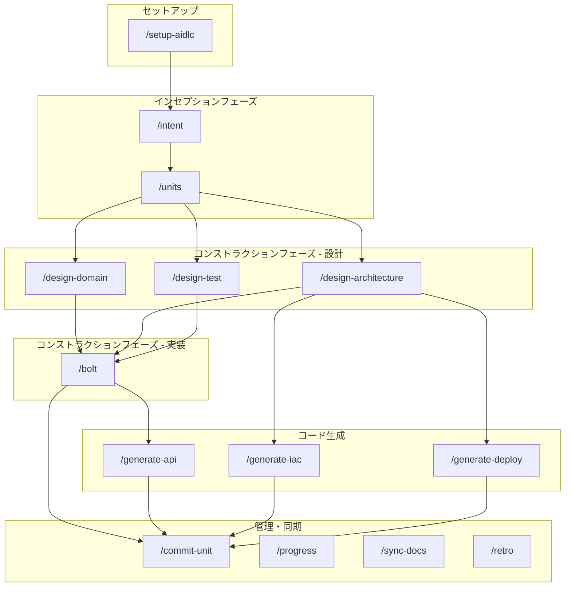
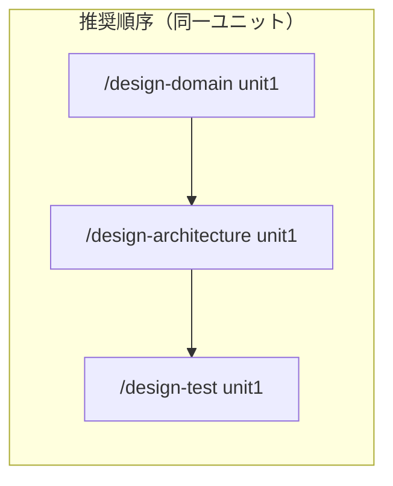
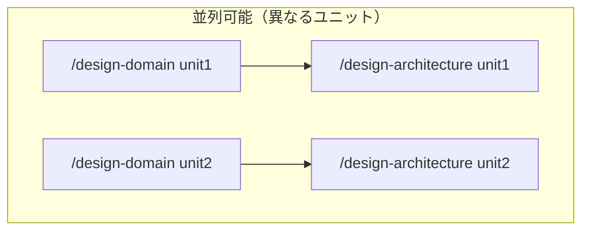
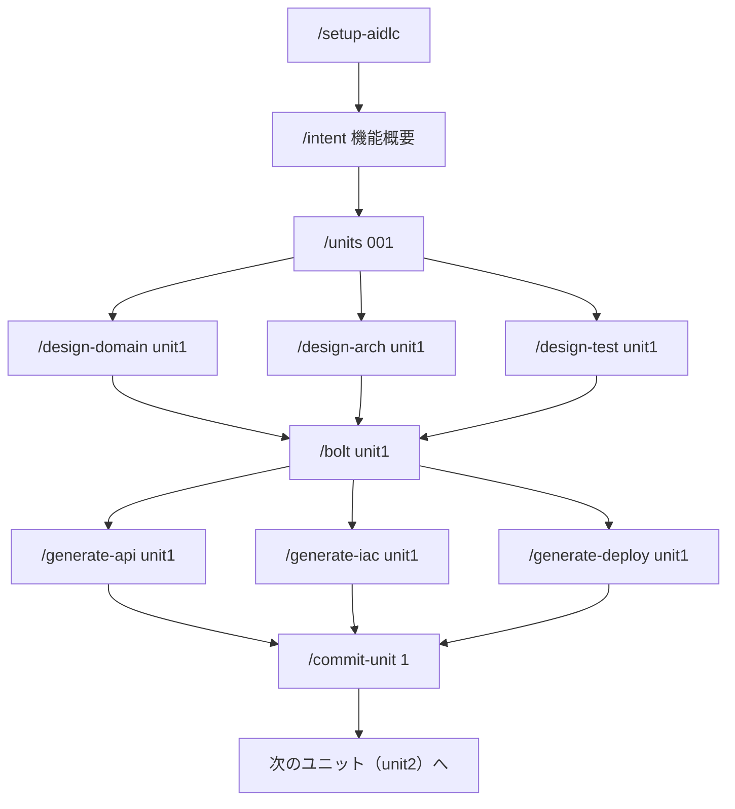
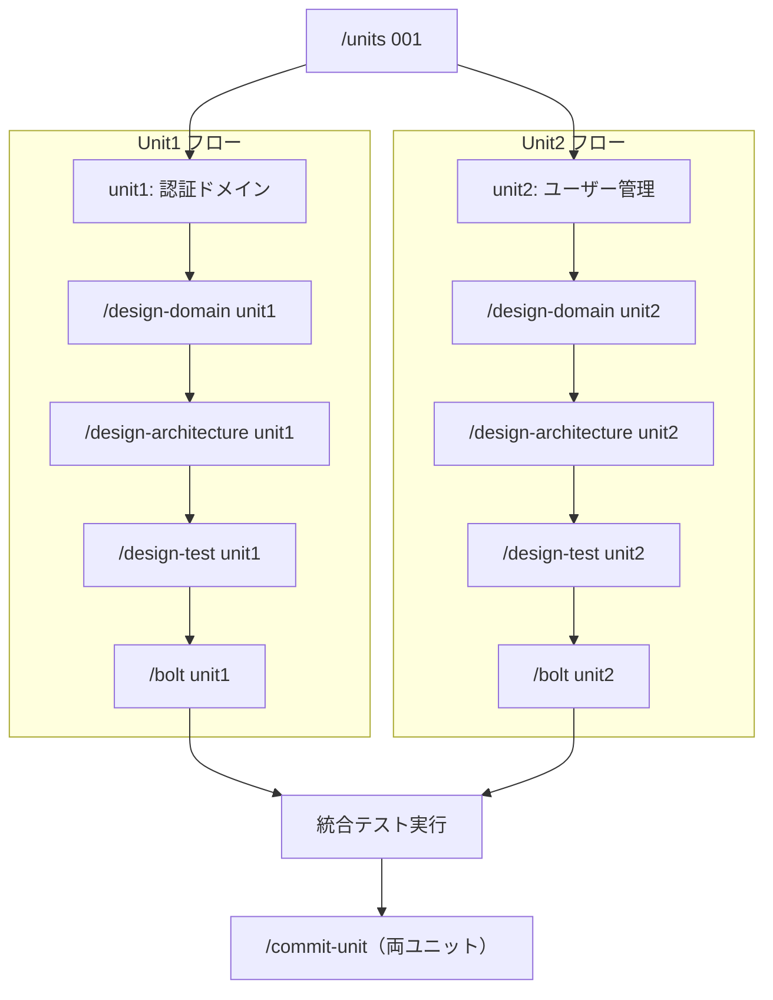
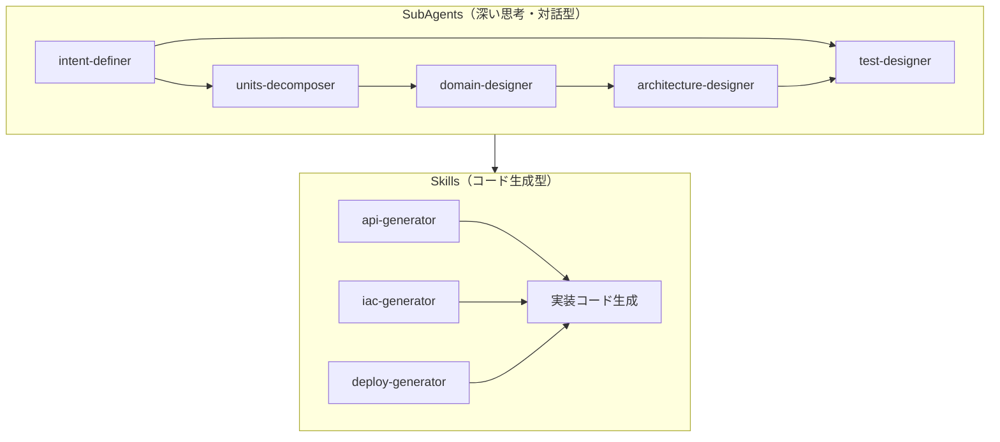
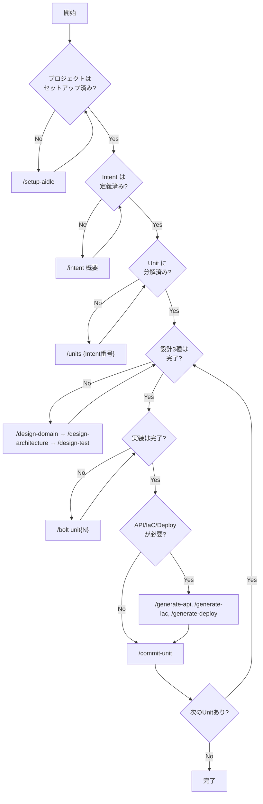

# AI-DLC コマンド依存関係図（DAG）

このガイドでは、AI-DLCスラッシュコマンド間の依存関係を図示し、正しい実行順序と並列実行可能な組み合わせを説明します。

## 全体依存関係図



## コマンド別依存関係

### 1. セットアップ

| コマンド | 前提条件 | 出力 |
|---------|---------|------|
| `/setup-aidlc` | なし（初回のみ） | package.json, pnpm-workspace.yaml, docs/ |

### 2. インセプションフェーズ

| コマンド | 前提条件 | 出力 |
|---------|---------|------|
| `/intent` | `/setup-aidlc` 完了 | docs/intents/{番号}_{タイトル}.md |
| `/units` | `/intent` で Intent 作成済み | docs/units/{Intent番号}_ユニット分解.md |

### 3. コンストラクションフェーズ - 設計

| コマンド | 前提条件 | 出力 | 並列実行 |
|---------|---------|------|---------|
| `/design-domain` | `/units` 完了 | docs/design-artifacts/domain/ | 可能* |
| `/design-architecture` | `/units` 完了 | docs/design-artifacts/architecture/, adr/ | 可能* |
| `/design-test` | `/units` 完了 | docs/design-artifacts/tests/ | 可能* |

**\*注意**: 3つの設計コマンドは**同一ユニットに対しては順次実行を推奨**。異なるユニット間では並列実行可能。





### 4. コンストラクションフェーズ - 実装

| コマンド | 前提条件 | 出力 |
|---------|---------|------|
| `/bolt` | 3つの設計コマンド完了 | src/, tests/, docs/plans/ |

### 5. コード生成

| コマンド | 前提条件 | 出力 | 並列実行 |
|---------|---------|------|---------|
| `/generate-api` | `/bolt` で services 層実装済み | packages/api/, docs/api/ | 可能 |
| `/generate-iac` | `/design-architecture` 完了 | terraform/ | 可能 |
| `/generate-deploy` | `/design-architecture` 完了 | .github/workflows/, scripts/ | 可能 |

```
並列実行可能:
/generate-api unit1  |  /generate-iac unit1  |  /generate-deploy unit1
```

## 詳細フロー図

### 新規プロジェクト開発フロー



### マルチユニット並列開発フロー

複数ユニットが**独立**している場合、並列開発が可能です：



**注意**: 依存関係があるユニット（例: unit3 → unit1）は順次実行が必要。

## SubAgent/Skill の使い分け



## 実行順序の判断フローチャート



## 補助コマンドの使用タイミング

| コマンド | 使用タイミング | 依存関係 |
|---------|---------------|---------|
| `/progress` | いつでも | なし |
| `/blocker` | 実装中にブロッカー発生時 | `/bolt` 実行中 |
| `/sync-docs` | 実装後、コミット前 | `/bolt` 完了後 |
| `/retro` | 会話終了時、フェーズ完了時 | なし |

## よくある間違い

### NG: 設計なしで実装

```bash
# ❌ 設計をスキップして bolt
/units 001
/bolt unit1  # エラー: 設計ドキュメントがありません
```

### NG: Intent なしでユニット分解

```bash
# ❌ Intent 未定義
/units  # エラー: Intent が見つかりません
```

### NG: services 層なしで API 生成

```bash
# ❌ bolt で services 層が未実装
/generate-api unit1  # 警告: services 層が見つかりません
```

## 参考資料

- [実装スコープ](./implementation-scope.md) - 各コマンドの完了条件
- [E2Eテストフロー](./e2e-testing-flow.md) - テスト実行タイミング
- [ワークフローガイド](./workflow.md) - フェーズ詳細
- [開始ガイド](./getting-started.md) - 最初のステップ
- [ベストプラクティス](./best-practices.md) - 推奨パターン
