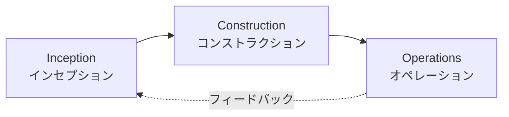

# AI-DLC ワークフローガイド

このガイドでは、AI-DLC（AI-Driven Development Lifecycle）の3つのフェーズと、各フェーズでのワークフローを説明します。

## AI-DLCの3つのフェーズ



### 1. Inception（インセプション）フェーズ

**目的**: 要件の明確化とプロジェクトの立ち上げ

**主な活動**:
- インテント定義（/intent）
- ユニット分解（/units）
- 初期リスク評価

**成果物**:
- `docs/intents/` - インテント定義
- `docs/units/` - ユニット分解
- `docs/requirements/` - 要件定義

### 2. Construction（コンストラクション）フェーズ

**目的**: 設計と実装の反復サイクル

**主な活動**:
- ドメイン設計（/design-domain）
- アーキテクチャ設計（/design-architecture）
- テスト設計（/design-test）
- 実装（/bolt）

**成果物**:
- `docs/design-artifacts/domain/` - ドメインモデル
- `docs/design-artifacts/architecture/` - アーキテクチャ設計
- `docs/design-artifacts/tests/` - テスト設計
- `docs/design-artifacts/adr/` - アーキテクチャ決定記録
- `src/` - 実装コード
- `tests/` - テストコード

### 3. Operations（オペレーション）フェーズ

**目的**: 運用、監視、継続的改善

**主な活動**:
- テレメトリ分析
- インシデント管理
- パフォーマンス最適化
- フィードバック収集

**成果物**:
- `docs/operations/` - 運用レポート
- 改善提案（新しいIntentへ）

## ワークフローパターン

### パターン1: 新機能開発（Greenfield）

**適用場面**: ゼロから新しい機能を開発する場合

```bash
# 1. インセプションフェーズ
/intent ユーザー認証機能の実装

# 2. ユニット分解
/units 001

# 3. 各ユニットの設計・実装（unit1の例）
/design-domain unit1
/design-architecture unit1
/design-test unit1
/bolt unit1

# 4. 次のユニット（unit2の例）
/design-domain unit2
/design-architecture unit2
/design-test unit2
/bolt unit2

# 5. 統合テスト・デプロイ
pnpm test
pnpm build
```

**特徴**:
- すべてのステップを順番に実行
- 設計ドキュメントを完全に作成
- TDD/BDDで実装

**推奨される場面**:
- 大規模な新機能
- 複数チームが関わるプロジェクト
- アーキテクチャに大きな影響がある場合

### パターン2: 既存機能の改善（Brownfield）

**適用場面**: 既存コードに対する機能追加や改善

```bash
# 1. インテント定義（改善内容を明確化）
/intent 認証機能のパフォーマンス改善

# 2. ユニット分解（影響範囲の特定）
/units 002

# 3. 既存設計の確認と更新
# 既存のドメイン設計を確認
cat docs/design-artifacts/domain/001-unit1_認証ドメイン.md

# アーキテクチャ設計を更新（必要に応じて）
/design-architecture unit1

# 4. テスト設計の更新
/design-test unit1

# 5. 実装
/bolt unit1
```

**特徴**:
- 既存設計を確認してから更新
- 影響範囲を最小化
- 後方互換性を維持

**推奨される場面**:
- バグ修正
- パフォーマンス改善
- 既存機能の拡張

### パターン3: 探索的開発（Spike）

**適用場面**: 技術検証やプロトタイプ作成

```bash
# 1. インテント定義（検証目的を明確化）
/intent GraphQL導入の技術検証

# 2. ユニット分解（検証範囲を限定）
/units 004

# 3. 最小限の設計
/design-architecture unit1  # ドメイン設計はスキップ

# 4. プロトタイプ実装
/bolt unit1

# 5. 結果の評価とADR作成
# docs/design-artifacts/adr/ に決定事項を記録
```

**特徴**:
- ドメイン設計を省略
- アーキテクチャパターンの検証に集中
- ADRで決定事項を記録

**推奨される場面**:
- 新技術の導入検討
- アーキテクチャパターンの比較
- パフォーマンステスト

## フェーズ間の移行

### Inception → Construction

**移行条件**:
- [ ] インテントが明確に定義されている
- [ ] ユニットに分解されている
- [ ] 各ユニットの責務と境界が明確
- [ ] 依存関係が可視化されている
- [ ] リスクが評価されている

**移行後のアクション**:
```bash
# 最初のユニットの設計フェーズ開始
/design-domain unit1
```

### Construction → Operations

**移行条件**:
- [ ] すべてのユニットが実装完了
- [ ] テストが全件パス
- [ ] NFRが満たされている
- [ ] ドキュメントが整備されている
- [ ] デプロイ準備完了

**移行後のアクション**:
```bash
# 運用フェーズ開始（未実装）
/operate

# または、継続的モニタリング
pnpm run monitor
```

### Operations → Inception（フィードバックループ）

**移行条件**:
- [ ] 運用上の問題が発見された
- [ ] パフォーマンス改善の必要性
- [ ] 新しいユーザー要求
- [ ] セキュリティ脆弱性

**移行後のアクション**:
```bash
# 改善インテントの定義
/intent パフォーマンス改善: 認証レスポンス時間を1秒以内に
```

## ベストプラクティス

### 1. インテント定義のベストプラクティス

**良い例**:
```
/intent ユーザー登録時のメール確認機能

- ビジネス価値: スパム登録を防止し、有効なユーザーのみを登録
- NFR: メール送信は5秒以内、確認トークンは24時間有効
- リスク: メールサービスのダウンタイム
```

**悪い例**:
```
/intent メール機能

- ビジネス価値: メールを送る
- NFR: なし
- リスク: わからない
```

### 2. ユニット分解のベストプラクティス

**原則**:
- **疎結合**: ユニット間の依存を最小化
- **高凝集**: 関連する機能を1つのユニットにまとめる
- **境界明確**: 各ユニットの責務と境界を明確に定義

**良い例**:
```markdown
## unit1: 認証ドメイン
**責務**: 認証情報の検証とトークン発行
**境界**: 認証ロジックのみ、ユーザー管理は含まない
**依存**: unit2（ユーザー情報の取得のみ）
```

**悪い例**:
```markdown
## unit1: ユーザー機能
**責務**: ユーザーに関するすべて
**境界**: 特になし
**依存**: すべてのユニット
```

### 3. 設計フェーズのベストプラクティス

**順序を守る**:
1. ドメイン設計（/design-domain）- ビジネスロジック
2. アーキテクチャ設計（/design-architecture）- NFRとパターン
3. テスト設計（/design-test）- BDD/TDD

**理由**: ドメインモデルがアーキテクチャの基礎となり、テストはそれらを検証する

### 4. Boltサイクルのベストプラクティス

**1サイクルで完結させる**:
- 計画 → 承認 → 実装 → テスト → 完了

**承認時の確認事項**:
- [ ] 実装手順が明確
- [ ] テスト計画が含まれている
- [ ] NFRが考慮されている
- [ ] 依存関係が解決されている

## トラブルシューティング

### インテントが曖昧すぎる

**症状**: ユニット分解ができない、設計が進まない

**対処法**:
1. Claudeの質問に詳細に答える
2. NFRを具体的な数値で定義
3. 受入基準をBDD形式（Given/When/Then）で記述

### ユニット間の依存が複雑すぎる

**症状**: 依存関係図が複雑、実装順序が不明

**対処法**:
1. ユニットを再分解（より小さく）
2. 境界を再定義（責務の明確化）
3. レイヤードアーキテクチャの導入

### Boltサイクルが失敗する

**症状**: テストが通らない、実装が進まない

**対処法**:
1. テスト設計を見直す（Red → Green → Refactorのサイクル）
2. 依存ユニットの実装状況を確認
3. アーキテクチャ設計との整合性を確認

## 参考資料

- [AI-DLC日本語訳](../AI-DLC_日本語訳.md) - 論文の完全な翻訳
- [AI-DLC準拠状況](../AI-DLC準拠状況.md) - 準拠率分析と実装状況
- [開始ガイド](./getting-started.md) - 最初のステップ

## まとめ

AI-DLCは、AIを活用した体系的な開発ライフサイクルです。3つのフェーズ（Inception, Construction, Operations）を通じて、品質の高いソフトウェアを効率的に開発できます。

**キーポイント**:
- インテント定義で要件を明確化
- ユニット分解で疎結合・高凝集を実現
- 設計フェーズで品質を作り込む
- Boltサイクルで高速に反復
- フィードバックループで継続的改善
